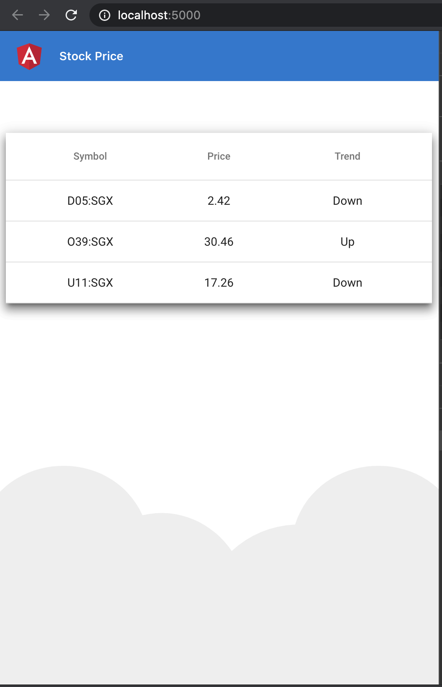

# stock-price-movement
stock price movement display

## Prerequisites
* Maven 3.6.1
* JDK >= 8
## Technologies
* Spring ( Spring-boot, Webflux )
* Angular
* SSE ( Server Sent Event )
* Observable
* Observer
* Subscription

## How to run it
* mvn clean spring-boot:run
* open browser http://localhost:5000/
* Screen shot

## Code Sample
* Server Sent Event
```
  @GetMapping(value="/stream-sse/[{symbols}]")
  public Flux<ServerSentEvent<StockPrice[]>> streamEvents(@PathVariable List<String> symbols) {
    return Flux.interval(Duration.ofSeconds(5))
      .map(e -> ServerSentEvent.<StockPrice[]> builder()
        .id(String.valueOf(e))
        .event("message")
        .data(getPrice(symbols))
        .comment("Periodic stock price update")
        .build());
  }
```
* Observable
```
  getStockPriceList(): Observable<StockPrice[]> {
    return new Observable((observer) => {

      let eventSource = new EventSource(this.stockPriceURL);

      eventSource.onmessage = (event) => {
        let json = JSON.parse(event.data);
        if (json !== undefined && json !== '') {
          this.zone.run(() => observer.next(json));
        }
      };


      eventSource.onerror = (error) => {
        if (eventSource.readyState === 0) {
          eventSource.close();
          observer.complete();
        } 
      }


      eventSource.onopen = (event) => {
        console.log("Opened event source :" + eventSource.readyState);
      }

      eventSource.close = () => {
        console.log("Closed event source :" + +eventSource.readyState);
      }


    });
  }
```

## Test code 
I tried to check how does it work E2E with SSE. Now I will try to find tune and test coverage.
## References
https://dzone.com/articles/tutorial-reactive-spring-boot-part-1-building-a-ko
https://dzone.com/articles/tutorial-reactive-spring-boot-part-2-a-rest-client
https://dzone.com/articles/tutorial-reactive-spring-boot-part-3-a-javafx-sprioo
https://dzone.com/articles/tutorial-reactive-spring-boot-part-4-a-javafx-line
https://dzone.com/articles/tutorial-reactive-spring-boot-part-5-auto-configur
https://blog.logrocket.com/how-to-execute-a-function-with-a-web-worker-on-a-different-thread-in-angular/

